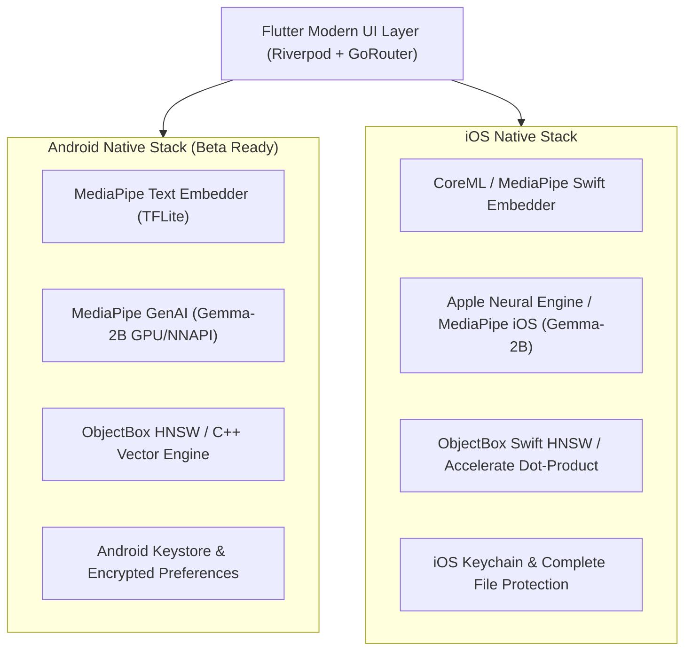

# EdgeTal — Feature Specification & Platform Roadmap

> **Private Talent Intelligence. On-Device.**  
> *Import. Search. Analyse. Hire smarter.*  
> **Status:** 🚀 **v1.0.0-beta.1 Ready for Google Play Store** (100% On-Device AI • GDPR Compliant)

---

## 🎨 Brand Identity & Color Palette

Extracted directly from [`assets/logos/edgetal.png`](file:///Users/madus/Documents/Github/skillvault-kotlin/assets/logos/edgetal.png), the visual system for EdgeTal is designed for a modern, recruiter-focused, enterprise-grade experience. It uses clean typography (**Poppins / Inter**), high-contrast elements, and dedicated status badges for on-device privacy.

### Primary Color Swatches (`edgetal.png`)

| Swatch | Color Name | Hex Code | Purpose & Usage |
| :---: | :--- | :--- | :--- |
| 🟦 | **Deep Midnight Navy** | `#133046` | Dominant headers, dark mode surfaces, primary typography, brand identity |
| 🌊 | **Ocean Teal** | `#4B9CB3` | Primary brand accent, active navigation items, interactive buttons |
| ❄️ | **Soft Ice Blue** | `#A9D0E5` | Card surface tinting, subtle text highlighting, search container borders |
| 🟡 | **Warm Gold** | `#EFBB47` | High candidate match score badges, star ratings, key candidate callouts |
| 🟠 | **Vibrant Amber** | `#E8842E` | Actionable insights, benchmark highlights, secondary buttons, warning states |
| 🟢 | **Privacy Emerald** | `#2E9E5B` | "100% On-Device AI" verification badge, zero-cloud indicators, success states |
| ⚪ | **Crisp White** | `#FFFFFF` | Light surface backgrounds, clean card backgrounds, high-contrast light mode |

### 🖼️ Asset Logos Bundle (`assets/logos/`)

| Asset Path | Usage in App & Store | Status |
| :--- | :--- | :---: |
| [`assets/logos/Icon Only.png`](file:///Users/madus/Documents/Github/skillvault-kotlin/assets/logos/Icon%20Only.png) | Sidebar/Navigation `_BrandMark`, Privacy Banner, App Launcher Icon | ✅ Configured |
| [`assets/logos/edgetal-logo-512.png`](file:///Users/madus/Documents/Github/skillvault-kotlin/assets/logos/edgetal-logo-512.png) | Google Play Store 512x512 Store Listing Icon | ✅ Configured |
| [`assets/logos/For Light Bgs.png`](file:///Users/madus/Documents/Github/skillvault-kotlin/assets/logos/For%20Light%20Bgs.png) | Light Theme Onboarding & Header Banner | ✅ Configured |
| [`assets/logos/For Dark Bgs.png`](file:///Users/madus/Documents/Github/skillvault-kotlin/assets/logos/For%20Dark%20Bgs.png) | Dark Theme Onboarding & Header Banner | ✅ Configured |
| [`assets/logos/Full-Logo.png`](file:///Users/madus/Documents/Github/skillvault-kotlin/assets/logos/Full-Logo.png) | High-Resolution Promotional Hero Header | ✅ Configured |

---

## 🤖 Google Play Store Beta Version Specification

EdgeTal is packaged as an Android App Bundle (`.aab`) targeting Android 14+ (API 34/36) with native MediaPipe acceleration:

| Configuration Parameter | Setting / Value | Notes |
| :--- | :--- | :--- |
| **Package ID / ApplicationId** | `com.knovik.edgetal` | Unique Google Play Store bundle identity |
| **Version Name** | `1.0.0-beta.1` | Public Beta Version String |
| **Version Code** | `2` | Build increment tracking for Play Console |
| **Min SDK Version** | `26` (Android 8.0 Oreo) | Mandatory minimum for MediaPipe LLM GenAI API |
| **Compile / Target SDK** | `36` / `34+` | Fully compliant with Google Play target API rules |
| **Model Asset Packaging** | `noCompress += listOf("tflite", "bin")` | Enables direct memory-mapping of local models |
| **Network & Privacy** | `android.permission.INTERNET` | Model weights download & optional CSV URL import only |

---

## 📱 Feature Matrix: Android vs. iOS

---

### 🤖 Android Feature List (Google Play Beta)

| Feature Category | Capability / Sub-Feature | Implementation Details & Native Technology | Implementation Status |
| :--- | :--- | :--- | :---: |
| **On-Device Embedding** | MediaPipe Text Embedder | `EmbedderChannel.kt` binding to `com.google.mediapipe:tasks-text:0.10.18`. Auto-detects embedding dimension (512d). | ✅ Live |
| **On-Device LLM Inference** | Gemma-2B Int4 GenAI | `LlmChannel.kt` binding to `com.google.mediapipe:tasks-genai:0.10.21`. Hardware accelerated via GPU / NNAPI / Vulkan. | ✅ Live |
| **Vector Search Engine** | Cosine & HNSW Similarity | ObjectBox native vector index for instant candidate retrieval with exact keyword + vector highlight toggles. | ✅ Live |
| **Model Management** | Resumable Download Manager | In-app download controller with pause/resume, progress bar, and storage quota monitoring. | ✅ Live |
| **Security & Privacy** | GDPR Hardware Encryption | Android Keystore backed AES-256 encrypted local storage for zero candidate data leakage. | ✅ Live |
| **Query Reformulation** | Local LLM Prompt Engineering | Automatic query expansion (e.g. "Python dev" → "Django, FastAPI, PyTest") using Gemma-2B. | ✅ Live |
| **Candidate Fit Analysis** | Explainable AI Breakdown | Generates structured candidate match rationale against pasted job descriptions on-device. | ✅ Live |
| **App Branding & Logo** | EdgeTal Logo Integration | `assets/logos/Icon Only.png` integrated into adaptive shell `_BrandMark` and Models screen Privacy Banner. | ✅ Live |

---

### 🍎 iOS Feature List

| Feature Category | Capability / Sub-Feature | Implementation Details & Native Technology | Implementation Status |
| :--- | :--- | :--- | :---: |
| **On-Device Embedding** | CoreML / MediaPipe Swift | `EmbedderChannel.swift` bridging to MediaPipe iOS Swift SDK & CoreML text embeddings. | 🟡 In Bridge Setup |
| **On-Device LLM Inference** | Metal / Apple Neural Engine (ANE) | Accelerated Gemma-2B execution using Metal Performance Shaders (MPS) & ANE. | 🟡 In Bridge Setup |
| **Vector Search Engine** | Accelerate Framework / ObjectBox | High-speed SIMD vector dot-product calculations using Apple Accelerate & ObjectBox Swift index. | 🟡 In Optimization |
| **Security & Privacy** | iOS Keychain & Data Protection | `NSFileProtectionComplete` ensuring candidate CVs are encrypted when device is locked. | ✅ Live |
| **Fluid iOS UX & Motion** | Cupertino Aesthetics & Haptics | Smooth Apple-style modal sheets, glassmorphism blur effects, and subtle `UIImpactFeedbackGenerator` haptics. | ✅ Live |

---

## ⚡ Enhancements & Feature Enhancement Tracker

### Phase 1: Core Foundation & Beta Release (Completed ✅)
- [x] Flutter Riverpod state management & GoRouter navigation shell
- [x] Android native MediaPipe embedding & LLM generation over platform channels (`EmbedderChannel.kt` & `LlmChannel.kt`)
- [x] Sample European candidate talent pool auto-seeding for immediate exploration
- [x] Semantic vector search with exact + vector highlight toggles
- [x] Candidate Fit analysis with Local LLM reasoning & verdict
- [x] Full theme system integration using `edgetal.png` extracted colors (`#133046`, `#4B9CB3`, `#A9D0E5`, `#2E9E5B`, `#EFBB47`, `#E8842E`)
- [x] Logo assets bundle (`assets/logos/`) registered in `pubspec.yaml` and embedded in `AppShell` & `ModelsScreen`
- [x] Google Play Store Beta metadata, package ID (`com.knovik.edgetal`), version (`1.0.0-beta.1+2`), and `noCompress` rules configured

### Phase 2: Play Console Beta Deployment & Native Polish (Active 🟡)
- [ ] Build Android App Bundle (`flutter build aab --release`) for Google Play Console submission
- [ ] iOS Native Channel completion (CoreML + MediaPipe Swift bridging)
- [ ] Batch PDF & DOCX resume file parser with automated section extraction
- [ ] Benchmarking suite with latency distribution metrics (p50, p95, p99)

---

*Document created for EdgeTal Project. Last updated: August 2026.*
