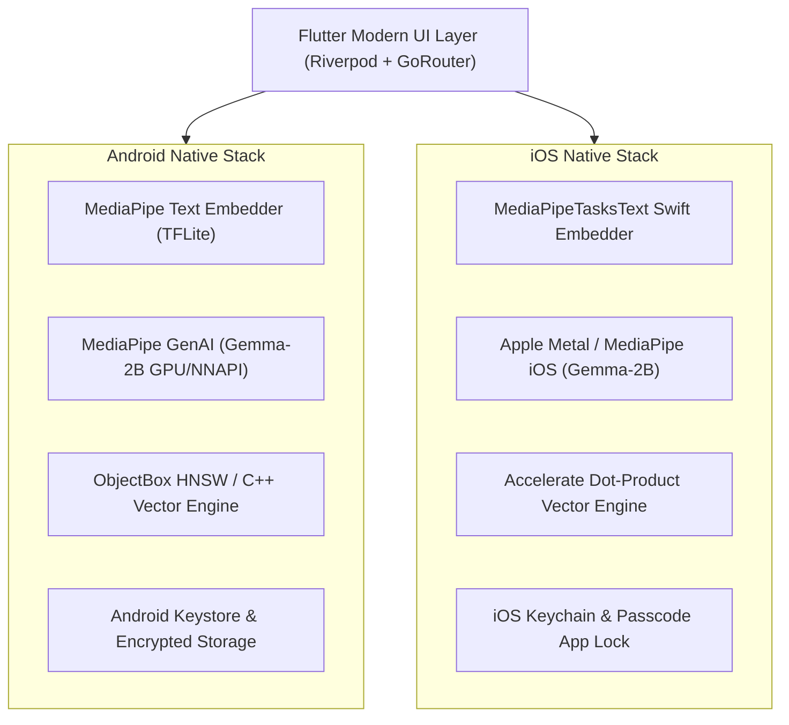

# EdgeTal — Feature Specification & Platform Architecture

> **Private Talent Intelligence. On-Device.**  
> *Import. Search. Analyze. Hire smarter — completely offline without cloud servers.*  
> **Status:** 🚀 **v1.0.1+6 TestFlight & Google Play Console Ready** (100% On-Device AI • GDPR Compliant)

---

## 🎨 Brand Identity & Color Palette

Extracted directly from [`assets/logos/edgetal.png`](file:///Users/madus/Documents/Github/skillvault-kotlin/assets/logos/edgetal.png), the visual system for EdgeTal is designed for a modern, recruiter-focused, enterprise-grade experience. It uses clean typography (**Poppins / Inter**), high-contrast elements, and dedicated status badges for on-device privacy.

### Primary Color Swatches (`edgetal.png`)

| Swatch | Color Name | Hex Code | Purpose & Usage |
| :---: | :--- | :--- | :--- |
| 🟦 | **Deep Midnight Navy** | `#133046` | Dominant headers, dark mode surfaces, primary typography, brand identity |
| 🌊 | **Ocean Teal** | `#4B9CB3` | Primary brand accent, active navigation items, interactive buttons |
| ❄️ | **Soft Ice Blue** | `#A9D0E5` | Card surface tinting, subtle text highlighting, search container borders |
| 🟡 | **Warm Gold** | `#EFBB47` | High candidate match score badges, star ratings, key candidate callouts |
| 🟠 | **Vibrant Amber** | `#E8842E` | Actionable insights, benchmark highlights, secondary buttons, warning states |
| 🟢 | **Privacy Emerald** | `#2E9E5B` | "100% On-Device AI" verification badge, zero-cloud indicators, success states |
| ⚪ | **Crisp White** | `#FFFFFF` | Light surface backgrounds, clean card backgrounds, high-contrast light mode |

### 🖼️ Asset Logos & App Launcher Icons

| Asset Path | Usage in App & Store | Status |
| :--- | :--- | :---: |
| [`assets/logos/Icon Only.png`](file:///Users/madus/Documents/Github/skillvault-kotlin/assets/logos/Icon%20Only.png) | Sidebar/Navigation `_BrandMark`, Privacy Banner, App Launcher Icon | ✅ Live |
| [`assets/logos/edgetal-logo-512.png`](file:///Users/madus/Documents/Github/skillvault-kotlin/assets/logos/edgetal-logo-512.png) | Store Listing Icon & iOS AppIcon set (`remove_alpha_ios: true`) | ✅ Live |
| [`assets/logos/For Light Bgs.png`](file:///Users/madus/Documents/Github/skillvault-kotlin/assets/logos/For%20Light%20Bgs.png) | Light Theme Onboarding & Header Banner | ✅ Live |
| [`assets/logos/For Dark Bgs.png`](file:///Users/madus/Documents/Github/skillvault-kotlin/assets/logos/For%20Dark%20Bgs.png) | Dark Theme Onboarding & Header Banner | ✅ Live |
| [`assets/logos/Full-Logo.png`](file:///Users/madus/Documents/Github/skillvault-kotlin/assets/logos/Full-Logo.png) | High-Resolution Promotional Hero Header | ✅ Live |

---

## 🤖 Platform Build & Release Specifications

EdgeTal is packaged and signed for iOS (TestFlight / App Store Connect) and Android (Google Play Store):

| Configuration Parameter | Setting / Value | Platform & Notes |
| :--- | :--- | :--- |
| **Package ID / ApplicationId** | `com.knovik.edgetal` | iOS Bundle ID & Google Play Package ID |
| **Version Name / Build Number** | `1.0.1+6` | App Version `1.0.1`, Build Increment `6` |
| **Minimum iOS Target** | `iOS 13.0` / `14.0` | Mandatory for `MediaPipeTasksText` iOS Swift Pod |
| **Min SDK Version (Android)** | `26` (Android 8.0 Oreo) | Mandatory minimum for MediaPipe LLM GenAI API |
| **Compile / Target SDK** | `36` / `34+` | Fully compliant with Google Play target API rules |
| **Model Asset Packaging** | `noCompress += listOf("tflite", "bin")` | Enables direct memory-mapping of local models |
| **Network & Privacy** | `android.permission.INTERNET` | Model weights download & optional CSV URL import only |

---

## 📱 Feature Matrix: Android vs. iOS

---

### 🌟 Comprehensive Feature Matrix

| Feature Category | Capability / Sub-Feature | Implementation Details & Native Technology | Implementation Status |
| :--- | :--- | :--- | :---: |
| **On-Device Embedding** | MediaPipe Text Embedder | `EmbedderChannel.kt` (Android) and `EmbedderChannel.swift` (iOS `MediaPipeTasksText`) building 512d vector representations. | ✅ Live |
| **On-Device LLM Inference** | Gemma-2B Int4 GenAI | `LlmChannel.kt` binding to `com.google.mediapipe:tasks-genai:0.10.21` with hardware CPU vs. GPU delegate selection. | ✅ Live |
| **GPU / CPU Model Toggle** | Hardware Inference Delegate | Switch between CPU execution and hardware GPU delegates (Tensor G2, Snapdragon, Metal) with state persistence. | ✅ Live |
| **Resumable Model Downloader** | Range & Redirect Downloader | HTTP range-based download manager with Hugging Face 302 redirect resolution and `.part` to `.bin` file promotion. | ✅ Live |
| **Integrated Job Pipeline** | Job Roles & Description Vector Ranking | SRS-compliant `JobRole` model storing job descriptions, skill badges, 512d embeddings, and `JobCandidateLink` pipeline stages. | ✅ Live |
| **Job Details & Kanban** | 3-Tab Job Detail View | Overview & Description, AI Candidate Vector Match Rankings, and Pipeline Stage Management (*Shortlisted* $\rightarrow$ *Placed*). | ✅ Live |
| **Job Selector in AI Fit** | Targeted Gemma-2B Reasoning | `AnalysisSheet` job selector dropdown auto-populating role descriptions into local LLM prompt for structured rationale. | ✅ Live |
| **Multi-Source Ingestion** | 3-Step Import Pipeline | 1. From Folder (PDF/DOCX), 2. Cloud Folder (iCloud Drive/Google Drive/OneDrive), 3. CSV (File or Link). Enabled on iOS & Android. | ✅ Live |
| **Interactive In-App Guides** | Spotlight Onboarding Tours | Guided tooltip overlays across Candidates, Import, Models, and Help screens with a "Replay Feature Tours" option. | ✅ Live |
| **Local Privacy Workspace** | Zero Cloud Account Gate | Replaced hardcoded user profile with `EdgeTal Private Workspace` status card (`48 Candidates · 3 Jobs · 🔒 100% On-Device Vault`). | ✅ Live |
| **Local Passcode Security** | `AppLockService` Vault Lock | Optional PIN passcode and biometric lock protecting local candidate resumes from physical unauthorized access. | ✅ Live |
| **Encrypted Backup Package** | Peer-to-Peer `.edgetal` Transfer | Password-protected encrypted backup package export/import for secure peer-to-peer team sharing without cloud servers. | ✅ Live |
| **Talent Pool Analytics** | Local Competency Index Matrix | On-device competency index matrix, skill distributions, and dataset metric visualizer on `InsightsScreen`. | ✅ Live |

---

## ⚡ Complete Release Checklist

- [x] Flutter Riverpod state management & GoRouter navigation shell
- [x] Android native MediaPipe embedding & LLM generation over platform channels (`EmbedderChannel.kt` & `LlmChannel.kt`)
- [x] iOS native `MediaPipeTasksText` CocoaPod & Swift platform channel bridge (`EmbedderChannel.swift`)
- [x] Resumable Model Weights Downloader with Hugging Face 302 redirect resolution & range resume
- [x] Hardware CPU vs. GPU LLM inference backend toggle with `SharedPreferences` persistence
- [x] Multi-source resume ingestion pipeline (1. From Folder, 2. Cloud Folder, 3. CSV File or Link)
- [x] Interactive in-app onboarding guide tours & replay system on `HelpScreen`
- [x] Integrated Job Role pipeline data model (`JobRole`, `JobCandidateLink`) & 3-tab `JobDetailScreen`
- [x] Job Role selector dropdown in Candidate AI Fit Analysis (`AnalysisSheet`)
- [x] Local Privacy Workspace drawer header replacing cloud sign-in/account profiles
- [x] Local passcode & biometric app lock security service (`AppLockService`)
- [x] Encrypted `.edgetal` backup package export & import service (`BackupPackageService`)
- [x] Talent pool competency index matrix on `InsightsScreen`
- [x] App Store launcher icons generated without alpha channel (`remove_alpha_ios: true`)
- [x] TestFlight release build `1.0.1+6` compiled (`build/ios/ipa/edgetal.ipa`)

---

*Document created for EdgeTal Project. Last updated: August 2026.*
