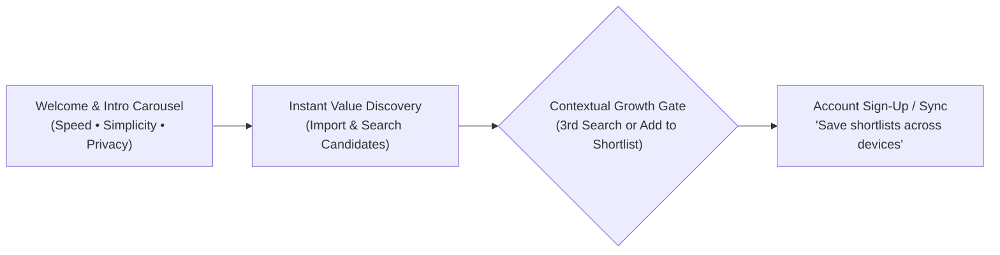

# EdgeTal — Marketing & User Growth Product Specification

> Derived directly from [`docs/Edge Tal App- UI Design Proposal.pdf`](file:///Users/madus/Documents/Github/skillvault-kotlin/docs/Edge%20Tal%20App-%20UI%20Design%20Proposal.pdf)  
> **Core Marketing Proposition:** *100% On-Device Talent Intelligence • Screen CVs in Minutes • Nothing Ever Leaves Your Phone*

---

> [!IMPORTANT]
> **BRAND & LOGO SPECIFICATION DIRECTIVE**  
> All logo designs, mark illustrations, and icon mockups shown in `Edge Tal App- UI Design Proposal.pdf` (Page 2) **MUST BE OMITTED**.  
> The official, authoritative logo assets for all marketing surfaces, banners, onboarding screens, app launcher icons, and UI components are strictly located in [`assets/logos/`](file:///Users/madus/Documents/Github/skillvault-kotlin/assets/logos/):
> - Primary Brand Architecture & System: [`assets/logos/edgetal.png`](file:///Users/madus/Documents/Github/skillvault-kotlin/assets/logos/edgetal.png)
> - Navigation & UI App Mark: [`assets/logos/Icon Only.png`](file:///Users/madus/Documents/Github/skillvault-kotlin/assets/logos/Icon%20Only.png)
> - Light Theme Headers & Onboarding: [`assets/logos/For Light Bgs.png`](file:///Users/madus/Documents/Github/skillvault-kotlin/assets/logos/For%20Light%20Bgs.png)
> - Dark Theme Headers & Onboarding: [`assets/logos/For Dark Bgs.png`](file:///Users/madus/Documents/Github/skillvault-kotlin/assets/logos/For%20Dark%20Bgs.png)
> - Store Listing & Launcher Icon: [`assets/logos/edgetal-logo-512.png`](file:///Users/madus/Documents/Github/skillvault-kotlin/assets/logos/edgetal-logo-512.png)

---

## 🎯 Executive Marketing Summary

The UI Design Proposal defines a user experience built on **frictionless value delivery first, conversion second**. Rather than blocking users with a sign-up wall, EdgeTal demonstrates speed, privacy, and semantic search capabilities instantly.

---

## 🚀 Key Marketing Features Required for Development

### 1. 🌟 Onboarding & Brand Storytelling Flow (Pages 3-5)
An interactive 4-slide onboarding carousel designed to build instant trust and educate recruiters:

- **Slide 1: Welcome & Intro**:
  - *Primary Message:* What EdgeTal does + the core privacy promise.
  - *Call to Action:* **"Get Started"** (Primary Navy `#133046`) + **"Skip"** text link (Teal `#4B9CB3`).
- **Slide 2: Speed Value Prop**:
  - *Headline:* **"Screen CVs in minutes"**
  - *Visual:* Vector illustration using brand palette (no photorealism).
- **Slide 3: Simplicity Value Prop**:
  - *Headline:* **"One app. Minimal setup. Built to fit into your workflow"**
- **Slide 4: Privacy Guarantee**:
  - *Headline:* **"Nothing ever leaves your phone"**

---

### 2. ⚡ Contextual Account Gate & Conversion Hook (Pages 3, 11-12)
- **Frictionless First Usage:**  
  *No account is required* to launch the app, import resumes, run semantic searches, or view benchmarks.
- **Contextual Sign-Up / Sign-In Trigger:**  
  Triggered automatically as a modal/bottom-sheet upon **the user's 3rd search** OR **first tap of "+ Add to Shortlist"** (whichever happens first).
- **Privacy-First Conversion Copy:**
  > **"Save your shortlists across sessions"**  
  > *Subtext:* "This only stores your account and app settings. Your candidates' data never leaves this device."
- **Dismissible Action:** Includes a top-right **"Not now"** teal link returning users seamlessly to search results.

---

### 3. 🖼️ Home / Dashboard Hero Banner (Page 6)
A high-converting visual anchor on the main dashboard to establish brand authority:

- **Full-Width Photo/Illustration Card**: Styled with soft candidate-network/workspace motifs and a dark navy gradient overlay.
- **Brand Elements**:
  - Official EdgeTal logo/wordmark from [`assets/logos/`](file:///Users/madus/Documents/Github/skillvault-kotlin/assets/logos/) in top-left (*omitting PDF placeholder logo*).
  - Bold Value Headline: **"Screen smarter. Stay private."**
  - Live Stat Pill: **"248 candidates ready to search"** (White pill with teal text `#4B9CB3`).
- **Drawer Menu Integration**: Three-dot top-left menu opening user account, plan details, and notification badges.

---

### 4. ⚡ Live Speed Benchmarking ("Proof of Performance") (Pages 14-15)
Recruiters and hiring managers love tangible proof of AI performance:

- **Headline:** **"Test on-device speed yourself — no data required"**
- **Hero Speed Stat Card:** Prominently displays real-time execution speeds (e.g., **"18ms LAST SEARCH SPEED"**).
- **Detailed Latency Breakdown Rows**:
  1. *Semantic Search Latency* (ms)
  2. *Embedding Generation Time* (ms)
  3. *Candidate Indexing Speed* (ms)
- **Marketing Purpose:** Serves as live visual proof of EdgeTal's superiority over slow cloud-based ATS competitors.

---

### 5. 🛡️ Trust & Education Center: "Help / How It Works" (Pages 17-18)
A plain-language FAQ system designed to overcome enterprise compliance hurdles and privacy skepticism:

- **Headline:** *"Plain answers, no jargon"*
- **Core Marketing Questions Addressed**:
  - *“Does my data ever leave my phone?”* → Clear explanation of local vector embeddings & offline execution.
  - *“How accurate is the AI match?”* → Transparency on skill, experience, and candidate summary scoring.
  - *“What happens if I lose my phone?”* → Instructions on local backup/export functionality.

---

### 6. 🔒 Candidate Data Ownership & Export System (Pages 15-16)
Empowers HR teams with full control over candidate records:

- **Headline:** **"Export your data — no cloud involved"**
- **Supported Formats:** One-tap export to **CSV** or **JSON**.
- **Privacy Lock Indicator:** Confirmation state badged in Privacy Emerald (`#2E9E5B`).

---

## 🎨 Color Palette Implementation Matrix (Page 1)

| Swatch Name | Hex Code | Marketing Role in App |
| :--- | :--- | :--- |
| **Dark Navy (Primary)** | `#133046` | Every primary CTA ("Get Started", "Import", "Search", "Run Benchmark", "Add to Shortlist") |
| **Teal (Secondary)** | `#4B9CB3` | Secondary buttons ("Yes", "Cancel"), active navigation, links, category tag pills |
| **Light Blue (Card Tint)** | `#A9D0E5` | Background for candidate cards, stat tiles, and section dividers |
| **Warm Yellow (Accent)** | `#EFBB47` | Match-confidence badges (mid-range %), candidate avatar backgrounds |
| **Vibrant Orange (Accent)** | `#E8842E` | Top-tier match strength badges, notification unread indicators |
| **Privacy Emerald (Status)** | `#2E9E5B` | "Indexed" success badges, "Runs on this device" confirmation checkmarks |

---

## 🗺️ Recommended Implementation Priority for Marketing Impact

| Priority Tier | Feature | Marketing Goal | Status |
| :---: | :--- | :--- | :---: |
| **P0** | **Onboarding 4-Slide Intro Carousel** | Drive user retention & communicate privacy promise on 1st launch | ⏳ Needed |
| **P0** | **Dashboard Hero Banner ("Screen Smarter. Stay Private.")** | Anchor brand identity & show live indexed candidate count | ⏳ Needed |
| **P1** | **Contextual 3rd-Search / Shortlist Account Gate** | Maximise conversion without upfront dropoff | ⏳ Needed |
| **P1** | **Live Speed Benchmarks Screen ("18ms Search")** | Provide concrete social proof of on-device AI speed | ⏳ Needed |
| **P2** | **"Help / How It Works" Plain-Language FAQ** | Remove recruiter skepticism & compliance friction | ⏳ Needed |

---

*Document compiled from `docs/Edge Tal App- UI Design Proposal.pdf` for the EdgeTal Growth & Product Team.*
