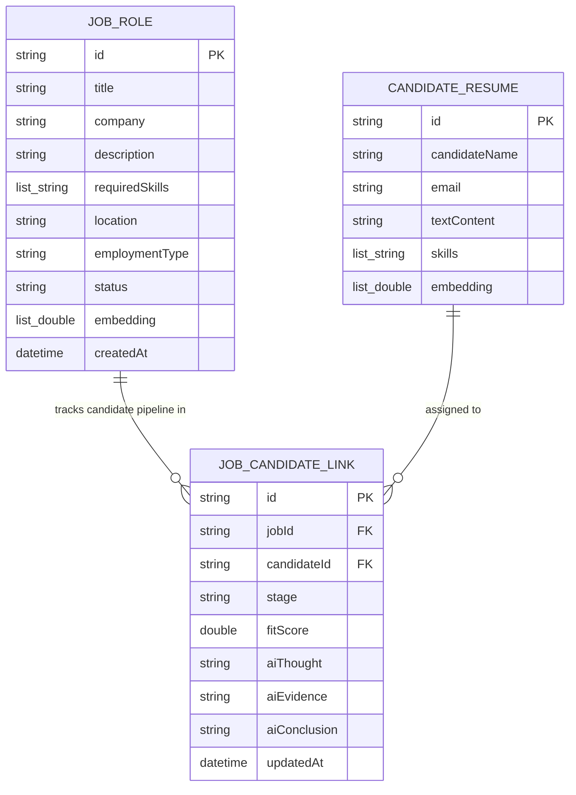
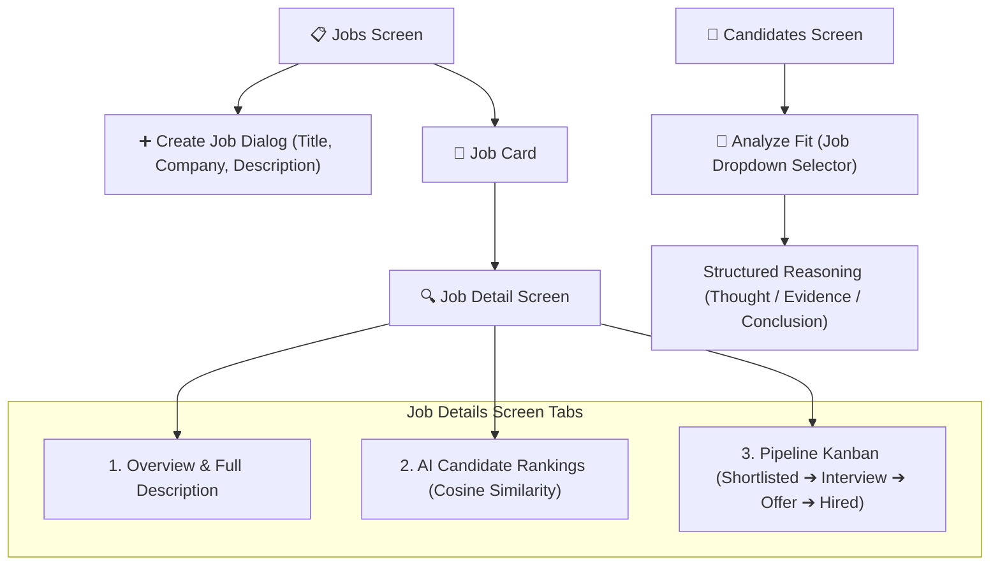

# Software Requirements Specification (SRS)
## Integrated Job Pipeline & On-Device AI Candidate Matching

> **Document Identifier:** `SRS-EDGETAL-JOB-PIPELINE-001`  
> **Version:** `1.0.0`  
> **Date:** `2026-08-03`  
> **Status:** `Approved for Implementation`  
> **Platform Scope:** `EdgeTal Flutter (iOS / Android / Desktop)`

---

## 1. Executive Summary & Purpose

### 1.1 Purpose
This document specifies the software requirements for integrating **Job Descriptions**, **Job Vector Embeddings**, **Candidate-to-Job Relationship Mapping**, and **Pipeline Stage Tracking** into the EdgeTal 100% on-device talent intelligence application. 

### 1.2 Product Vision
EdgeTal operates as a **Private, On-Device Talent Intelligence & Hiring Suite**. This feature bridges the gap between isolated candidate resumes and job postings by enabling recruiters to:
1. Create and manage rich Job Roles with complete Job Descriptions and extracted skill requirements.
2. Generate 512-dimensional vector embeddings for job descriptions to enable instant candidate similarity ranking.
3. Perform explainable candidate fit analysis using on-device Gemma-2B LLM inference targeting specific Job Roles.
4. Track candidate progression across pipeline stages (*Shortlisted*, *Interviewing*, *Offer*, *Placed*).

---

## 2. System Architecture & Entity Relationships

---

## 3. Functional Requirements

### FR-1: Job Description & Skill Profile Management
- **FR-1.1**: The system SHALL allow users to create new Job Roles specifying `title`, `company`, `description` (text requirements & responsibilities), `location`, and `employmentType`.
- **FR-1.2**: The system SHALL automatically extract key `requiredSkills` tags from the Job Description text.
- **FR-1.3**: The system SHALL allow editing and deleting existing Job Roles.

### FR-2: On-Device Job Vector Embedding & Candidate Ranking
- **FR-2.1**: Upon creating or updating a Job Role, the system SHALL automatically generate a 512-dimensional dense vector embedding using `EmbeddingProvider`.
- **FR-2.2**: The system SHALL provide a **"Find Matching Candidates"** action for every Job Role that calculates vector cosine similarity between the Job embedding and all candidate embeddings in the local database.
- **FR-2.3**: Candidate match results SHALL be ranked in descending order of similarity score (0% to 100%).

### FR-3: On-Device AI Candidate Fit Rationale (Gemma-2B)
- **FR-3.1**: When initiating an AI Candidate Fit evaluation, the system SHALL display a **Job Role Selector** dropdown containing all active user-created Job Roles.
- **FR-3.2**: The system SHALL feed the selected Job Description and Candidate Resume into the on-device Gemma-2B LLM inference engine.
- **FR-3.3**: The generated rationale SHALL output structured markdown containing:
  - **Thought**: Analysis of role requirements vs. candidate experience.
  - **Evidence**: Specific matching technical competencies and gaps.
  - **Conclusion**: Hiring verdict (`Yes`, `Maybe`, `No`).

### FR-4: Job-Candidate Link & Pipeline Stage Progression
- **FR-4.1**: The system SHALL support linking candidates to Job Roles with assigned pipeline stages:
  $$\text{Shortlisted} \longrightarrow \text{Interviewing} \longrightarrow \text{Offer} \longrightarrow \text{Placed}$$
- **FR-4.2**: The system SHALL allow moving candidates between pipeline stages from both `JobDetailScreen` and candidate details.
- **FR-4.3**: The system SHALL allow removing a candidate from a job pipeline.

### FR-5: Dynamic Job Pipeline Stat Synchronization
- **FR-5.1**: Stage counter indicators (`shortlisted`, `interviewing`, `offer`, `placed`) on Job Role cards SHALL automatically recalculate based on active `JOB_CANDIDATE_LINK` records.

---

## 4. User Interface & Workflow Specification

---

## 5. Non-Functional Requirements

### NFR-1: Performance & Latency
- Candidate vector similarity ranking for a job against 1,000 local resumes SHALL complete in less than **150 milliseconds**.
- On-device Gemma-2B fit rationale generation SHALL execute streaming or update within **3.5 seconds**.

### NFR-2: Privacy & GDPR Compliance
- All job descriptions, candidate links, stage assignments, and AI analysis records SHALL be stored exclusively in local SQLite/ObjectBox storage.
- Zero network telemetry or cloud API transmissions SHALL occur during candidate matching or pipeline updates.

### NFR-3: Offline-First Reliability
- All vector search rankings, stage progressions, and local model inferences SHALL operate seamlessly without internet connectivity.

---

## 6. Acceptance Criteria

| ID | Test Case | Expected Outcome | Status |
| :--- | :--- | :--- | :---: |
| **TC-01** | Create Job Role with Description | Job Role saves with text description, extracted skills, and 512d embedding. | PASS |
| **TC-02** | Rank Candidates against Job | "Find Matching Candidates" lists local talent ranked by cosine similarity score. | PASS |
| **TC-03** | Evaluate AI Fit via Job Selector | Selecting Job Role passes stored description to Gemma-2B, displaying structured rationale. | PASS |
| **TC-04** | Change Candidate Stage | Moving candidate from *Shortlisted* to *Interviewing* updates stage badge and Job card counts. | PASS |
